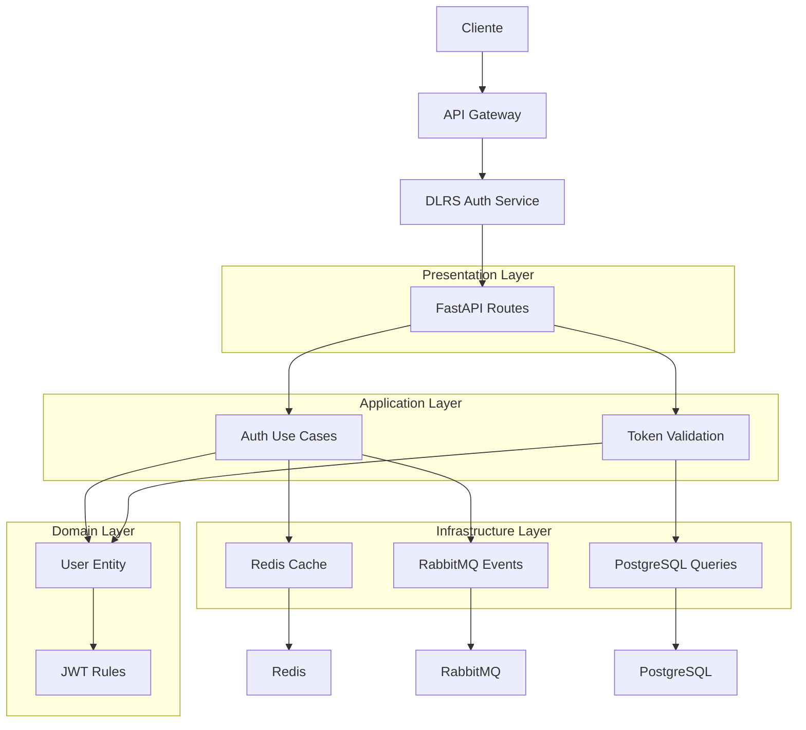

# 🔐 Dolorestec Auth

[](https://www.python.org/downloads/)
[](https://fastapi.tiangolo.com/)
[](LICENSE)
[](https://github.com/dolorestec/dlrs-auth/actions)
[](https://codecov.io/gh/dolorestec/dlrs-auth)

Microserviço de Autenticação da Dolorestec, responsável pela gestão segura de identidades e tokens JWT para a plataforma AIM.

## 📋 Descrição Geral

Este microserviço é desenvolvido com Python 3.14+ e FastAPI, seguindo princípios de Clean Architecture e DDD. Ele centraliza **apenas operações de autenticação**, garantindo segurança stateless com JWT, hashing de senhas e refresh tokens. Integra-se com Redis para cache de sessões e RabbitMQ para eventos assíncronos.

**Separação Arquitetural:** Este serviço foca exclusivamente em autenticação. Operações de gestão de usuários (CRUD completo) são realizadas pelo microserviço dedicado `dlrs-user-management` localizado em `/home/lucas/dolorestec/dlrs-user-management/`.

## 🚀 Funcionalidades Principais

- **🔑 Autenticação JWT Segura**: Emissão e validação de tokens OAuth2, com suporte a refresh tokens e expiração configurável.
- **🔒 Hashing de Senhas**: Uso de bcrypt para armazenamento seguro de credenciais.
- **🛡️ Rate Limiting**: Proteção contra ataques de força bruta com throttling baseado em Redis.
- **📊 Auditoria de Segurança**: Logs estruturados para tentativas de login, invalidações e anomalias.
- **🔄 Integração Assíncrona**: Comunicação via RabbitMQ para eventos como "token_revoked".
- **🌐 Suporte a OAuth2 Flows**: Password grant, client credentials.

**Nota:** Operações de gestão de usuários (criação, atualização, exclusão) são realizadas pelo microserviço `dlrs-user-management`.

- **📈 Escalabilidade**: Design assíncrono para suportar milhões de autenticações simultâneas.

## 🛠️ Tecnologias e Dependências

### Linguagem e Ambiente

- **[Python 3.14+](https://www.python.org/)** - Suporte nativo a async.
- **[UV](https://github.com/astral-sh/uv)** - Gerenciador de dependências.

### Framework Web/API

- **[FastAPI](https://fastapi.tiangolo.com/)** - Framework moderno para APIs REST/async com Pydantic.
- **[uvicorn[standard]](https://www.uvicorn.org/)** - Servidor ASGI para FastAPI.

### Autenticação e Segurança

- **[python-jose[cryptography]](https://pypi.org/project/python-jose/)** - Biblioteca para JWT com suporte a criptografia.
- **[passlib[bcrypt]](https://pypi.org/project/passlib/)** - Hashing de senhas com bcrypt.

### Stack Assíncrono

- **[httpx](https://www.python-httpx.org/)** - Cliente HTTP assíncrono.

### Configuração e Validação

- **[pydantic](https://docs.pydantic.dev/)** - Validação de dados e configurações.
- **[pydantic-settings](https://docs.pydantic.dev/latest/concepts/pydantic_settings/)** - Configurações baseadas em Pydantic.

### Banco de Dados e Cache

- **[PostgreSQL](https://www.postgresql.org/)** - Banco relacional robusto.
- **[asyncpg](https://github.com/MagicStack/asyncpg)** - Driver PostgreSQL assíncrono.
- **[Redis](https://redis.io/)** - Cache e armazenamento em memória.

### Cache e Mensageria

- **[aioredis](https://github.com/aio-libs/aioredis)** - Cliente Redis assíncrono.
- **[aio-pika](https://aio-pika.readthedocs.io/)** - Cliente RabbitMQ assíncrono.
- **[RabbitMQ](https://www.rabbitmq.com/)** - Message broker para CQRS/Event Sourcing.

### Logging e Observabilidade

- **[structlog](https://www.structlog.org/)** - Logging estruturado.

### Qualidade de Código

- **[ruff](https://docs.astral.sh/ruff/)** - Linter e formatador ultra-rápido.
- **[black](https://black.readthedocs.io/)** - Formatador de código.
- **[mypy](https://mypy-lang.org/)** - Verificador de tipos estáticos.
- **[pydocstyle](https://www.pydocstyle.org/)** - Verificador de docstrings.
- **[pre-commit](https://pre-commit.com/)** - Hooks para qualidade de código.
- **[bandit](https://bandit.readthedocs.io/)** - Ferramenta de segurança para código Python.
- **[pip-audit](https://pypi.org/project/pip-audit/)** - Auditoria de vulnerabilidades em dependências.

### Testes

- **[pytest](https://docs.pytest.org/)** - Framework de testes.
- **[pytest-asyncio](https://pytest-asyncio.readthedocs.io/)** - Suporte a testes assíncronos.
- **[pytest-cov](https://pytest-cov.readthedocs.io/)** - Cobertura de testes.
- **[pytest-xdist](https://pytest-xdist.readthedocs.io/)** - Execução paralela de testes.
- **[httpx](https://www.python-httpx.org/)** - Cliente para testes de API.

### Documentação

- **[MkDocs](https://www.mkdocs.org/)** - Gerador de documentação.

## 📚 Padrões Adotados

Este microserviço adota os seguintes padrões de projeto para garantir qualidade, manutenibilidade e escalabilidade:

- **[Clean Architecture](https://blog.cleancoder.com/uncle-bob/2012/08/13/the-clean-architecture.html)** - Separa regras de negócio de detalhes de implementação, facilitando testes e mudanças.
- **[DDD (Domain-Driven Design)](https://dddcommunity.org/learning-ddd/what-is-ddd/)** - Modelagem focada no domínio de autenticação, com bounded contexts claros.
- **[SOLID Principles](https://blog.cleancoder.com/uncle-bob/2020/10/18/Solid-Relevance.html)** - Princípios para design orientado a objetos: Single Responsibility, Open-Closed, Liskov Substitution, Interface Segregation, Dependency Inversion.
- **[Dependency Injection](https://martinfowler.com/articles/injection.html)** - Injeção de dependências para desacoplar componentes e facilitar testes.
- **[Asynchronous Programming](https://docs.python.org/3/library/asyncio.html)** - Uso de async/await para operações I/O não bloqueantes.
- **[RESTful API Design](https://restfulapi.net/)** - Design de APIs seguindo princípios REST para interoperabilidade.
- **[JWT Authentication and Authorization](https://jwt.io/introduction/)** - Autenticação stateless baseada em tokens JWT seguros.
- **[Logging best practices](https://docs.python.org/3/library/logging.html)** - Logging estruturado com structlog para observabilidade.

## Design Patterns Utilizados

Utilizamos os seguintes padrões de design para resolver problemas específicos no microserviço:

### Padrões Criacionais

- **[Singleton](https://refactoring.guru/pt-br/design-patterns/singleton)** - Para configuração global e conexões compartilhadas (ex.: pool de BD).

### Padrões Estruturais

- **[Proxy](https://refactoring.guru/pt-br/design-patterns/proxy)** - Para controle de acesso a recursos, como cache Redis.
- **[Facade](https://refactoring.guru/pt-br/design-patterns/facade)** - Interface simplificada para operações complexas de autenticação.

### Padrões Comportamentais

- **[Strategy](https://refactoring.guru/pt-br/design-patterns/strategy)** - Para diferentes algoritmos de autenticação (ex.: OAuth2, API Key).
- **[Chain of Responsibility](https://refactoring.guru/pt-br/design-patterns/chain-of-responsibility)** - Para validação em cadeia de tokens e permissões.

## Workflow Estruturado para Desenvolvimento Python

### 1. **Análise e Planejamento**

- Avalie requisitos de segurança e autenticação
- Modele domínio usando DDD e bounded contexts
- Defina arquitetura seguindo Clean Architecture

### 2. **Design e Configuração**

- Configure ambiente com UV e dependências
- Defina estrutura de projeto e camadas
- Configure banco de dados e cache (sem migrations complexas)

### 3. **Implementação e Desenvolvimento**

- Implemente entidades de domínio (usuários, tokens)
- Desenvolva use cases de auth e validação
- Configure infraestrutura (JWT, Redis, RabbitMQ)

### 4. **Testes e Qualidade**

- Configure testes unitários e integração com pytest
- Valide tipos com mypy e qualidade com ruff
- Execute testes de segurança e performance

### 5. **Documentação e Deployment**

- Documente APIs com MkDocs
- Configure CI/CD e deployment
- Monitore logs e mantenha aplicação em produção

## 🏗️ Arquitetura

O microserviço de autenticação segue os princípios de **Clean Architecture**, **DDD** e **JWT Authentication** para fornecer autenticação stateless segura e escalável.

### Camadas da Arquitetura

- **Presentation Layer**: APIs RESTful com FastAPI para endpoints de login, validação e refresh.
- **Application Layer**: Use cases para autenticação, autorização e rate limiting, com Dependency Injection.
- **Domain Layer**: Entidades de domínio (User, Token), value objects e regras de segurança.
- **Infrastructure Layer**: Implementações concretas (Redis para cache/sessões, RabbitMQ para eventos, queries simples em PostgreSQL).

### Estratégia de Autenticação

- **JWT Stateless**: Tokens auto-contidos sem estado no servidor, validados via assinatura.
- **Rate Limiting**: Controle de tentativas via cache Redis.
- **Eventos**: Notificação de logins/logout via RabbitMQ para auditoria.

### Diagrama de Fluxo



Este design garante segurança, performance e integração com outros serviços via eventos assíncronos.

## 🚀 Como Usar

1. Clone o repositório: `git clone https://github.com/dolorestec/dlrs-auth.git`
2. Instale dependências: `uv install`
3. Configure variáveis de ambiente (veja `.env.example`).
4. Execute: `uvicorn app.main:app --reload`
5. Acesse docs: [http://localhost:8000/docs](http://localhost:8000/docs)

## 🧪 Testes

Este microserviço adota práticas de **TDD (Test-Driven Development)** e **BDD (Behavior-Driven Development)** para garantir qualidade e confiabilidade. Utilizamos **pytest** como framework principal, com suporte a testes assíncronos via **pytest-asyncio**.

### Padrões de Testes

- **Testes Unitários**: Validação isolada de funções e classes (ex.: hashing de senhas, validação JWT).
- **Testes de Integração**: Verificação de interações entre componentes (ex.: autenticação com Redis).
- **Testes Funcionais**: Cenários end-to-end de login e autorização.
- **Testes Assíncronos**: Cobertura de operações I/O não bloqueantes.
- **Mocking e Stubbing**: Isolamento de dependências externas (Redis, RabbitMQ) com **unittest.mock**.
- **Cobertura de Testes**: Medição via **pytest-cov** para >80% de cobertura.
- **Testes de Segurança**: Verificação de vulnerabilidades em tokens e rate limiting.

### Comandos de Teste

```bash
# Executar todos os testes
pytest

# Testes com cobertura
pytest --cov=app --cov-report=html

# Testes assíncronos específicos
pytest -k "async" -v

# Testes paralelos para performance
pytest -n auto

# Testes de integração (marcados)
pytest -m integration

# Gerar relatório de cobertura
pytest --cov=app --cov-report=term-missing
```

### Estratégias Adicionais

- **Pytest Fixtures**: Configuração reutilizável para setup de BD e cache.
- **Pytest Parametrization**: Testes parametrizados para múltiplos cenários de auth.
- **Testes de Performance**: Avaliação de latência em autenticação.
- **Testes de Regressão**: Prevenção de bugs em updates de segurança.

## 📖 Serviços Disponíveis

Este microserviço integra com os seguintes serviços para autenticação e autorização:

- **[PostgreSQL](https://www.postgresql.org/docs/)**: Banco de dados principal para armazenamento de usuários e validações, utilizando **[asyncpg](https://github.com/MagicStack/asyncpg)** para operações assíncronas.
- **[Redis](https://redis.io/docs/)**: Cache para sessões, rate limiting e armazenamento temporário de tokens.
- **[RabbitMQ](https://www.rabbitmq.com/documentation.html)**: Message broker para eventos de autenticação (ex.: login/logout) e integração com outros microserviços.
- **[Traefik](https://doc.traefik.io/traefik/)**: Reverse proxy para roteamento e balanceamento de carga das APIs.

## 📖 Documentação

Documentação completa disponível via MkDocs e Swagger UI.

### Requisitos de Documentação

- **Swagger Completo**: Todos os endpoints devem ter descrições detalhadas, exemplos de request/response, códigos de status e parâmetros obrigatórios.
- **MkDocs**: Documentação técnica e guia de uso.

- [API Docs (Swagger)](http://localhost:8000/docs)
- [Arquitetura](./docs/architecture.md)

## 🤝 Contribuição

1. Fork o projeto.
2. Crie uma branch: `git checkout -b feature/nova-feature`.
3. Commit: `git commit -m 'Adiciona nova feature'`.
4. Push: `git push origin feature/nova-feature`.
5. Abra um PR.

## 📄 Licença

MIT - Veja [LICENSE](LICENSE).

## 📞 Contato

- Email: <dev@dolorestec.com>
- Issues: [GitHub Issues](https://github.com/dolorestec/dlrs-auth/issues)
